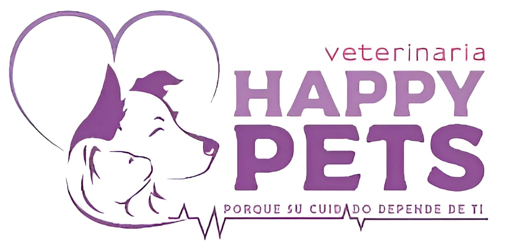

## VETERINARIA HAPPYPETS-HCO

## SOBRE EL PROYECTO 

Este proyecto está construido con Laravel v11 y Livewire v3, permitiendo la creación de componentes en tiempo real sin la necesidad de utilizar JavaScript. La plataforma está diseñada para gestionar de manera eficiente los servicios y productos de una veterinaria, brindando a los usuarios una experiencia rápida y fluida.

### Funcionalidades principales:
- **Gestión de Productos y Servicios:** Administración completa de los productos y servicios ofrecidos por la veterinaria, con categorías, precios, descuentos y disponibilidad de stock.
- **Módulo de Clientes y Mascotas:** Registro detallado de clientes y sus mascotas, con funcionalidades para llevar el historial médico, cirugías, vacunaciones, tratamientos, y servicios de aseo.
- **Sistema de Pedidos:** Los usuarios pueden realizar pedidos de productos y servicios desde la web, con opción de seguimiento y pago en línea.
- **Dashboard en Tiempo Real:** Utilizando ApexCharts, el sistema ofrece gráficos en tiempo real sobre las ventas, productos más vendidos y estadísticas de atención a las mascotas.
- **Notificaciones Interactivas:** A través de Toastify, los usuarios son notificados de manera interactiva sobre el estado de sus pedidos, alertas y promociones.
- **Seguridad y Autenticación:** Utilizando autenticación avanzada y permisos configurados en formato JSON para gestionar accesos de usuarios y empleados.

### Integraciones:
- **Onirix:** Para implementar funcionalidades de realidad aumentada (AR), permitiendo a los usuarios visualizar productos de manera innovadora.
- **Izipay:** Para procesar pagos en línea de manera segura y confiable.

### Tecnologías Utilizadas:
- **Laravel 11**: Framework de backend que permite la construcción de aplicaciones web robustas y escalables.
- **Livewire v3**: Herramienta para el desarrollo de interfaces interactivas en tiempo real sin necesidad de JavaScript.
- **Tailwind CSS**: Framework de diseño utilizado para construir interfaces de usuario modernas y responsivas.
- **ApexCharts**: Librería de gráficos para mostrar datos interactivos y visuales.
- **Figma**: Herramienta de diseño utilizada para la planificación y prototipado de la interfaz de usuario.
- **Vite**: Para la compilación rápida y eficiente de archivos de estilo y scripts.

### DESARROLLADORES

- Jhon R
- Edward J
